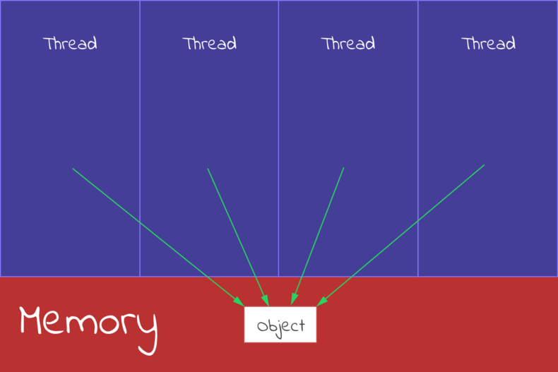
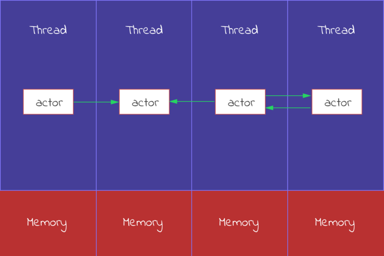
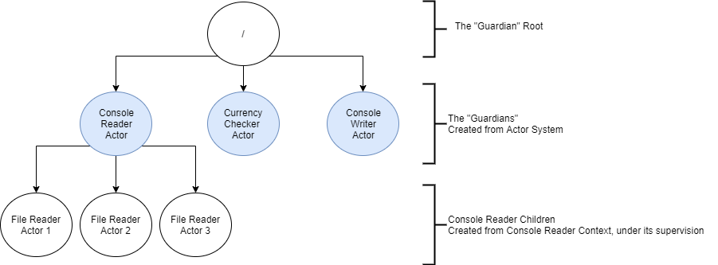
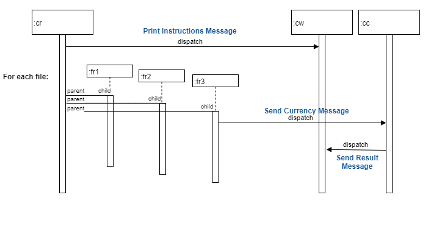

# TEST Akka.NET

## References

- [Akka Bootcamp](https://github.com/petabridge/akka-bootcamp)
- [Akka.NET API Doc](http://api.getakka.net/docs/stable/html/5590F8C9.htm)
- [Actors Vs Objects](https://anthonylebrun.silvrback.com/actors-vs-objects)
- [Akka.NET Stumbling Blocks](https://petabridge.com/blog/top-7-akkadotnet-stumbling-blocks/)
- [What problems does the actor model solve?](https://doc.akka.io/docs/akka/2.5.3/scala/guide/actors-intro.html)

## Actor Model

### But Why?

The Actor Model is a paradigm born to solve issues that OOP was not originally designed for. Instead of thinking of objects, we think in terms of actors that interact with each other by intermediary of ummutable messages. 

#### OOP & Multithreading

We rarely work with single-threaded applications. Very often, we have to work with long running jobs, blocking network or IO operations... and if you want to have a little bit of efficiency to your system, you would need to work with multi-threading. OOP was not really optimised for concurrency and in order to protect your objects' state of race conditions, we rely on locks (on a more or less abstracted way).

```csharp
class Test1
{    
     private IList<int> _data = new List<int>();

     public bool updateData(){
          _data.Add(_data.Count()); // would require a lock to work properly or use a concurrent collection
     }
}

class Program
{
     void main()
     {
          var test = new Test1();
	  Task.Run(() => (test.updateData());
	  Task.Run(() => (test.updateData());
     }
}
```

In the actor model approach, each actor has its own dedicated thread and memory, built-in into the frameworks. You won't have to manage yourselves the threads, each actor lives isolated from each other and share nothing: 

| Traditional OOP | Actor Model |
| ------------- | ------------- |
|   |  |

#### Encapsulation

One of the important principle of OOP is encapsulation, the internal object state is only accessible through getters and setters from the other classes. By not letting the actors calling directly each other, the actor model covers the encapsulation in a more isolated way.

### Main concepts

App1 solution is a sample code for discovering the main concepts. 

The aim of the application is to read all the files of a directory provided by the user. Each files contain a list of currencies for which we call an API to retrieve current FX rates. We define 4 actor type of actors: 
* **Console Reader Actor** (cr): who reads from the Console 
* **Console Writer Actor** (cw): who writes to the console
* **Currency Checker Actor** (cc): who will call the FX API
* **File Reader Actors** (fr0): spawned by the Console Reader for each file to read the file one row at a time and tell the currency to process to the currency checker

#### Actor Communication

#### Hierarchy & Supervision

## Actor Model Frameworks in .NET

## Integration with the REST of the world

### Distributed Services

### Integration to ASP.NET Core

# Notes

## Actor Model

### Proto.Actor

Proto.Actor is a Next generation Actor Model framework.

Proto.Actor was created by Roger Johansson, the original creator of Akka.NET. The reason for creating yet another actor model framework was due to the many design issues faced while building Akka.NET. Akka.NET required the team to build custom thread pools, custom network layers, custom serialization, custom configuration support and much more. All interesting topics on their own, but yield a huge cost in terms of development and maintenance hours.

Proto.Actor focuses on only solving the actual problems at hand, concurrency and distributed programming by reusing existing proven building blocks for all the secondary aspects.

Proto.Actor uses Protobuf for serialization, a decision that vastly simplifies the way Proto.Actor works. Message based systems should be about passing information, not passing complex OOP object graphs or code.

Proto.Actor also uses gRPC, leveraging HTTP/2 streams for network communication.

[Benchmark Akka.NET vs Proto.Actor](https://github.com/Blind-Striker/actor-model-benchmarks)

### Actors vs Objects

Distribution: The second implication of share nothing is that technically actors don't have to live on the same machine. In fact, certain implementations of the actor model (like the Erlang VM) let you spawn actors transparently on different nodes. That is the beauty of the actor model: it redefines what concurrency is. Traditionally concurrency is thought of as using multiple cores on one machine at the same time. In the world of actors, the concept of concurrency not only includes scaling across CPU cores, but scaling across a computer network.

### Actors communication

Actors communicate with each other just as humans do, by exchanging messages. 

You code actors to handle messages they receive, and actors can do whatever you need them to in order to handle a message. Talk to a database, write to a file, change an internal variable, or anything else you might need.

In addition to processing a message it receives, an actor can:
* Create other actors
* Send messages to other actors (such as the Sender of the current message)
* Change its own behavior and process the next message it receives differently

All actors are created within a certain context. That is, they are "actor of" a context. The base context is defined by Akka.Actor.ActorSystem. The Context holds metadata about the current state of the actor, such as the Sender of the current message and things like current actors Parent or Children.

You never talk directly to an actor—you send messages to its IActorRef (reference or handle to an actor) and the ActorSystem takes care of delivering those messages for you. The purpose of an IActorRef is to support sending messages to an actor through the ActorSystem. 

#### Configuration

Props is a configuration class that encapsulates all the information needed to make an instance of a given type of actor. Props get extended to contain deployment information and other configuration details that are needed to do remote work. For example, Props are serializable, so they can be used to remotely create and deploy entire groups of actors on another machine somewhere on the network! Props support a lot of the advanced features (clustering, remote actors, etc) that give Akka.NET the serious horsepower which makes it interesting.

#### Supervision

Supervision is the basic concept that allows your actor system to quickly isolate and recover from failures. Every actor has another actor that supervises it, and helps it recover when errors occur. Every actor has a parent, and some actors have children (created from their own context). Parents supervise their children. The "guardians" are the root actors of the entire system, whenever you make an actor directly from the context of the actor system itself, that new actor is a top level actor. The / actor is the base actor of the entire actor system, and may also be referred to as "The Root Guardian." 

Every actor has an address. To send a message from one actor to another, you just have to know it's address or "ActorPath". 

For example, if we were running on localhost, the full address of actor b2 would be akka.tcp://MyActorSystem@localhost:9001/user/a2/b2 with a2 parent of b2. 

When things go wrong, that's when! Whenever a child actor has an unhandled exception and is crashing, it reaches out to its parent for help and to tell it what to do. Specifically, the child will send its parent a message that is of the Failure class. Then it's up to the parent to decide what to do.

When it receives an error from its child, a parent can take one of the following actions ("directives"). The supervision strategy maps different exception types to these directives, allowing you to handle different types of errors as appropriate.

Types of supervision directives (i.e. what decisions a supervisor can make): Restart the child (default); Stop the child (permanently terminates), Escalate the error (and stop itself): this is the parent saying "I don't know what to do! I'm gonna stop everything and ask MY parent!", Resume processing (ignores the error). There are two built-in supervision strategies: One-For-One says that the directive issued by the parent only applies to the failing child actor. All-For-One says that the directive issued by the parent applies to the failing child actor AND all of its siblings.

The whole point of supervision strategies and directives is to contain failure within the system and self-heal, so the whole system doesn't crash. We push potentially-dangerous operations from a parent to a child, whose only job is to carry out the dangerous task (such as a nasty network call). 

If the parent actor is stopped, all of its children are recursively stopped, too. 

Restarts are not visible from the outside: collaborating actors can keep continuing sending messages while the target actor restarts.

Eg. Implementation of a file reader





#### Actor Selection

We know that we need a handle to an actor in order to send it a message and get it to do work. But now we have actors all over the place in this hierarchy, and don't always have a direct link (IActorRef) to the actor(s) we want to send messages to.

ActorSelection is nothing more than using an ActorPath to get a handle to an actor or actors so you can send them a message, without having to store their actual IActorRefs.

However, be aware that while ActorSelection is how you look up an IActorRef, it's not inherently a 1-1 lookup to a single actor.

In general, you should always try to use IActorRefs instead. But there are a couple of scenarios where ActorSelection are the right tool for the job and we cover those in more detail here: ["When Should I Use ActorSelection."](https://petabridge.com/blog/when-should-I-use-actor-selection/)

```csharp
Context.ActorSelection("akka://MyActorSystem/user/validationActor").Tell(message);
```

#### IActorRef being passed into message

Another alternative is to pass the IActorRef inside a message that is getting sent somewhere else in the system for processing. When that message is received, the receiving actor will know everything it needs to in order to do its job without the implementation details. This pattern actually promotes loose coupling.

### Actor lifecycle


### Stumbling blocks

#### Messages are immutables

One of the fundamental principles of designing actor-based systems is to make 100% of all message classes immutable, meaning that once you allocate an instance of that object its state can never be modified again.

```csharp
public class ImmutableMessage{
	public ImmutableMessage(string name, ReadOnlyList<int> points){
		Name = name;
		Points = points;
	}

	public string Name {get; private set;}
	public ReadOnlyList<int> Points {get; private set;}
}
```

**Hack**:
If you can't make the class immutable, there is a [HOCON configuration](https://getakka.net/articles/concepts/configuration.html) setting  you can turn on that will force each message to be serialized and deserialized to each actor who receives it, which guarantees that each actor receives their own unique copy of the message (akka.actor.serialize-messages). Intended for testing only, serialization is costly.

#### Cancellable long-running actions inside OnReceive

Actors process exactly one message at a time inside their Receive method, as shown below. This makes it extremely simple to program actors, because you never have to worry about race conditions affecting the internal state of an actor when it can only process one message at a time.

Unfortunately, there’s a price you pay for this: if you stick a long-running operation inside your Receive method then your actors will be unable to process any messages, including system messages, until that operation finishes. And if it’s possible that the operation will never finish, it’s possible to deadlock your actor.

The solution to this is simple: you need to encapsulate any long-running I/O-bound or CPU-bound operations inside a Task and make it possible to cancel that task from within the actor.

```csharp
public class FooActor : ReceiveActor,
						IWithUnboundedStash{

	private Task _runningTask;
	private CancellationTokenSource _cancel;

	public IStash Stash {get; set;}

	public FooActor(){
		_cancel = new CancellationTokenSource();
		Ready();
	}

	private void Ready(){
		Receive<Start>(s => {
			var self = Self; // closure
			_runningTask = Task.Run(() => {
				// ... work
			}, _cancel.Token).ContinueWith(x =>
			{
				if(x.IsCancelled || x.IsFaulted)
					return new Failed();
				return new Finished();
			}, TaskContinuationOptions.ExecuteSynchronously)
			.PipeTo(self);

			// switch behavior
			Become(Working);
		})
	}

	private void Working(){
		Receive<Cancel>(cancel => {
			_cancel.Cancel(); // cancel work
			BecomeReady();
		});
		Receive<Failed>(f => BecomeReady());
		Receive<Finished>(f => BecomeReady());
		ReceiveAny(o => Stash.Stash());
	}

	private void BecomeReady(){
		_cancel = new CancellationTokenSource();
		Stash.UnstashAll();
		Become(Ready);
	}
}
```

Cf. [Using Pipe](https://petabridge.com/blog/akkadotnet-async-actors-using-pipeto/)

#### Can't rely on DI

Some actors live very short lives - they might only be used for a single request before they’re shutdown and discarded. Other actors of the same type can potentially live forever and will remain in memory until the application process is terminated. This is a problem for most DI containers as most of them expect to work with objects that have fairly consistent lifecycles - not a blend of both. On top of that, many disposable resources such as database connections get recycled in the background as a result of connection pooling - so your long-lived actors may suddenly stop working if you’re depending on a DI framework to manage the lifecycle of that dependency for you.

Thus it’s considered to be a good practice for actors to manage their own dependencies, rather than delegate that work to a DI framework.

If an actor needs a new database connection, it’s better for the actor to fetch that dependency itself than to trust that the DI framework will do the right thing. Because most DI frameworks are extremely sloppy about cleaning up resources and leak them all over the place, as we’ve verified through extensive testing and framework comparisons. The only DI framework that works correctly by default with Akka.NET actors is Autofac.

#### Avoid awaiting async methods

Actors are inherently asynchronous and concurrent - every time you send a message to an actor you’re dispatching work asynchronously to it. But because the async and await keywords aren’t there, a commonly held view among some new Akka.NET users is that therefore the IActorRef.Tell operation must be “blocking.” This is incorrect - Tell is asynchronous; it puts a message into the back of the destination actor’s mailbox and moves on. The actor will eventually process that message once it makes it to the front of the mailbox.

Moreover, inside many Receive methods we see end users develop lots of nested async / await operations inside an individual message handler. There’s a cost overlooked by most users to doing this: the actor can’t process any other messages between each await operation because those awaits are still part of the “1 message at a time” guarantee for the original message!

## Communications with other apps

### Add a REST layer

How to expose your actor based system to the world? You can try to do so by leveraging Akka.Remote package with its location transparency feature, but it would imply that all your clients use Akka.NET as well. It’s one hell of an assumption in this day and age when microservices rule the world. So we go for REST, then. 

[Proposed Implementation](https://havret.io/akka-net-asp-net-core)
[Code Sample](https://github.com/Havret/akka-net-asp-net-core)
[Another Example](https://medium.com/@FurryMogwai/building-a-basket-micro-service-using-asp-net-core-and-akka-net-ea2a32ca59d5)

### Akka Cluster

https://github.com/petabridge/akkadotnet-code-samples/tree/master/Cluster.WebCrawler
https://www.freecodecamp.org/news/how-to-make-a-simple-application-with-akka-cluster-506e20a725cf/

An akka cluster represents a fault-tolerant, elastic, decentralized peer-to-peer network of Akka.NET applications with no single point of failure or bottleneck

Akka.Cluster is a layer of abstraction on top of Akka.Remote, that puts Remoting to use for a specific structure: clusters of applications. Under the hood, Akka.Remote powers Akka.Cluster, so anything you could do with Akka.Remote is also supported by Akka.Cluster.

Akka Cluster gives you out-of-the-box the discovery of members in the same cluster. Using Cluster Aware Routers it is possible to balance the messages between actors in different nodes. It is also possible to choose the balancing policy, making load-balancing a piece of cake!

#### Types of routers:

* Group Router: The actors to send the messages to — called routees — are specified using their actor path. The routers share the routees created in the cluster. 


* Pool Router — The routees are created and deployed by the router, so they are its children in the actor hierarchy. Routees are not shared between routers. This is ideal for a master-slave scenario, where each router is the master and its routees the slaves.


#### Use Cases

Akka.Cluster lends itself naturally to high availability scenarios.

To put it bluntly, you should use clustering in any scenario where you have some or all of the following conditions:
* A sizable traffic load
* Non-trivial to perform
* An expectation of fast response times
* The need for elastic scaling (e.g. bursty workloads)
* A microservices architecture

Some of the use cases where Akka.Cluster emerges as a natural fit are in:
* Analytics
* Marketing Automation
* Multiplayer Games
* Devices Tracking / Internet of Things
* Alerting & Monitoring Systems
* Recommendation Engines
* Dynamic Pricing
* ...
